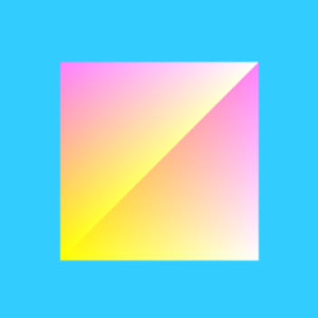

CC-NC-BY Hyeonseok Shin

# From tutorial1 To simple mouse drag

2021-1, Computer Graphics (F030-1, Prof. Hwanyong Lee)\
201823779 software Hyeonseok Shin

## It consists of a total of 6 steps from step 1 of the tutorial, and finally teaches how to transform the camera by dragging with the mouse.

_Every steps has the codes of it, output result, and some gif files that help students to understand it well._

## Tutrial 1. A simple thing we can do is draw a simple triangles

With this code, you can understand the vertex shader and fragment shader and warm up by drawing a simple 2D triangle. \

## Tutrial 2. Using shaders to apply color

Let's understand the principle by coloring vertices and learn more about varying that interfaces between vertex and fragment shaders. \

## Tutrial 3. makeing the square plane

Click gl-matrix.js to download it from the homepage and use it to make a rectangle.\ Your knowledge of vertices will improve in this part. \

## Tutrial 4. makeing the square rotate

Let's start by making the square rotate. we'll need is a variable in which to track the current rotation of the square

Let's use the rotateX, rotateY, rotateZ functions in gl-matrix.js and understand the concept of the axis. You must understand and move on to the tutorial required for the next step.

## Tutrial 5. creating 3D square rotate

Let's take our square plane into three dimensions by adding five more faces to create a cube. In this tutorial, we will do four things:

1. Define the positions of the cube's vertices
2. Define the vertices' colors
3. Define the element array
4. Drawing the cube

## Tutrial 6. Dragging 3D square

Hover your mouse over it to try it out\
You can view various sides of an object by dragging the mouse in the desired direction.\ Press the auto-rotate button to rotate around the y-axis.\
You can also drag with the mouse at this time. Other buttons increase and decrease the speed, and you can see the existing shape as a line or a dot.

# References

https://www.opengl.org/sdk/docs/tutorials/ClockworkCoders/varying.php

https://developer.mozilla.org/en-US/docs/Web/API/WebGL_API/Tutorial/Using_shaders_to_apply_color_in_WebGL

https://www.w3schools.com/jsref/event_onmousemove.asp

https://git.ajou.ac.kr/hwan/webgl-tutorial/-/blob/master/student2020/better_project/201721097/README.md

https://git.ajou.ac.kr/hwan/webgl-tutorial/-/blob/master/student2020/better_project/201621161/index.html

https://github.com/hwan-ajou/webgl-1.0
